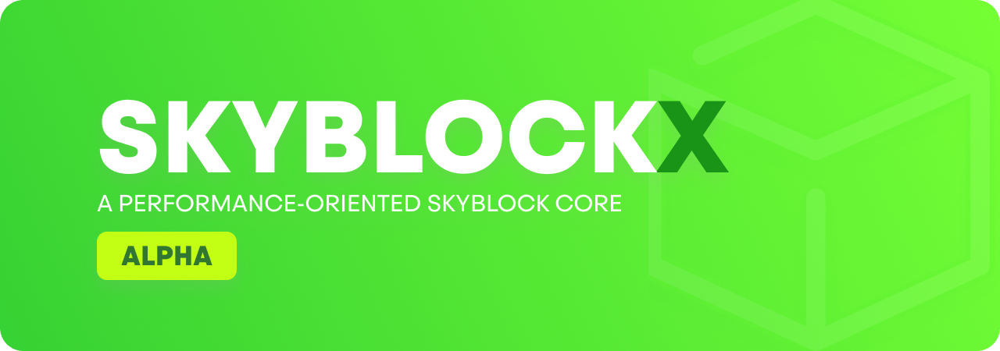

## About
A modern, fully functional skyblock core with minimal dependencies. 
The plugin's primary deployment and testing version is the latest version of spigot available. SkyblockX was designed because of ASkyblock being discontinued and also not being supported past Spigot-1.12 and all replacements being poorly designed or unstable.